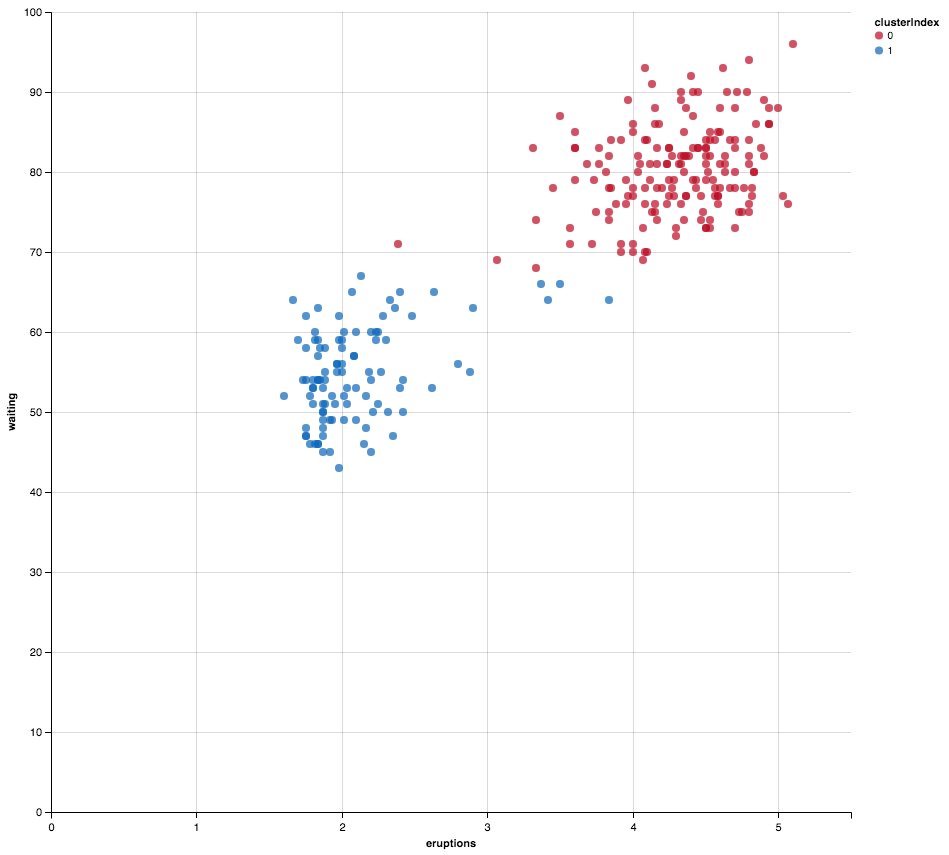

# Kmeans
This is a scala implementation of the K-Means clustering algorithm written in a functional way i.e. using [functional programming](https://en.wikipedia.org/wiki/Functional_programming). The algorithm is well-known, a [good explanation here](https://en.wikipedia.org/wiki/K-means_clustering). As a short summary it uses alternating iterations of assigning each datapoint to its closest centroid and re-evaluating the centroid position, which is the mean of all its data points.

## Initialising Centroids
Currently one method of initialising the centroids is used, called RUNFP [and discussed here](https://stats.stackexchange.com/questions/317493/methods-of-initializing-k-means-clustering). The idea behind this method is to make the candidate centroids as far apart as possible. The method selects the first k points to be centroids initially. It then updates these k candidate centroids according to the following rule applied to each of the k candidate centroids. If the candidate centroid is further from the nearest existing centroid than the distance between the two closest existing centroids then use the candidate centroid instead of the closer of the two to the existing centroids.

## Example
An example based on the Old Faithful geyser is in the `example` directory. Running clustering on this dataset produces the output shown below. A `Plotter` object is included to plot the output of clustering in 2 dimensions like this example.



## Usage
The application takes command line arguments:
 1. The format of file to process (csv only currently)
 1. The filepath to the datafile
 1. Whether the file has a header
 1. Whether to plot the output
 
To run the app via sbt:
```
sbt run csv example/old_faithful.csv True True
```
To compile an uber jar with all dependencies use `sbt assembly`. This allows you to run on a system without scala (e.g. with java) like below
```
java -jar Kmeans-assembly-0.2.jar csv example/old_faithful.csv True True
```
The sbt assembly command will generate the uber jar at `target/scala-2.11/Kmeans-assembly-0.2.jar` in your project directory.
